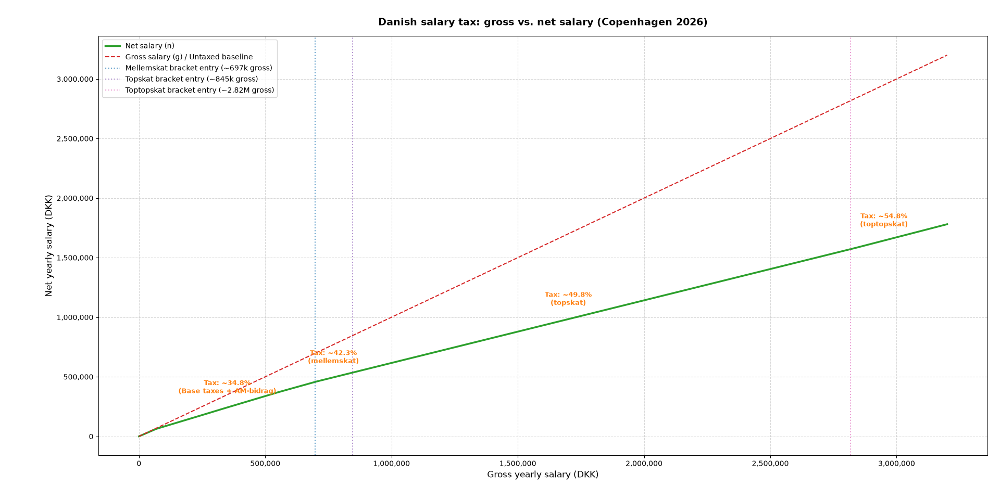
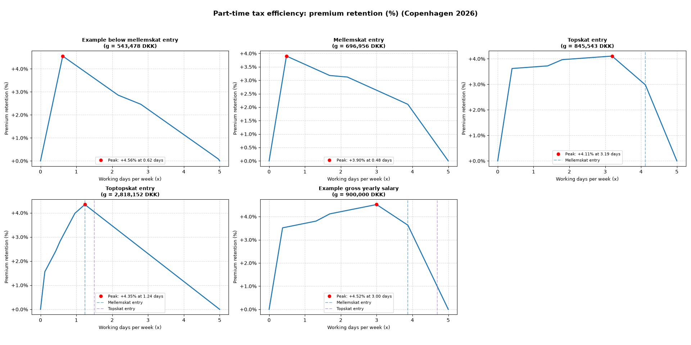

# part-time-tax-efficiency

This script evaluates the variations in tax efficiency achieved through part-time employment models within the Danish labor market under the 2026 Danish rules.

## Model

Let:
- $g$ be the yearly gross salary.
- $\mathtt{skat}(g)$ be a function getting the yearly gross salary and returning the yearly net salary.
- $n$ be the yearly net salary.
- $x \in [0,5]$ be the number of working days per week.
- $g_r(x) = \frac{x}{5} \cdot g$ be the gross yearly salary retained taking into account part-time. It is assumed gross yearly salary increases uniformly with respect to the number of working days per week.
- $g_r^\\%(x) = \frac{g_r(x)}{g}$ be the percentual gross yearly salary retained taking into account part-time.
- $n_r(x) = \mathtt{skat}(g_r(x))$ be the net yearly salary retained taking into account part-time.
- $n_r^\\%(x) = \frac{n_r(x)}{n}$ be the percentual net yearly salary retained taking into account part-time.

In the adopted model, tax efficiency is quantified by the premium retention function:

$$p_r^\\%(x) = n_r^\\%(x) - g_r^\\%(x)$$

Thus, the optimal number of working days per week $x_{\text{opt}}$ is defined as:

$$x_{\text{opt}} = \arg\max_{x \in [0,5]} \left( p_r^\\%(x) \right)$$

## Analysis

Given the taxation function below:

*Figure 1: Comparison between gross salary and net salary under the 2026 Copenhagen tax rules.*

It is possible to observe variation in tax efficiency:

*Figure 2: Analysis of the premium retention for different full-time yearly gross salaries. Specifically, the bracket entry points are taken into account.*

## Example

For a gross yearly salary $g = 900,000$ DKK, topskat entry threshold is crossed at full-time capacity.
* By working $x=5$ days per week, the net salary represents a baseline of $100\%$ of full-time net value for $100\%$ of full-time labor time ($p_r^\\%(5) = 0\%$).
* By working $x=3$ days per week, labor time decreases to $60\%$ of full-time, yet the retained net salary is $64.52\%$ of the full-time baseline net yield ($n$). 

Thus a positive retention premium is generated:
$$p_r^\\%(3) = 64.52\% - 60.00\% = +4.52\%$$

Note that while absolute net cash is lower for $x=3$, lowering the gross salary base below the mellemskat entry threshold optimizes tax efficiency, allowing the worker to retain a higher proportion of net salary relative to time invested.
